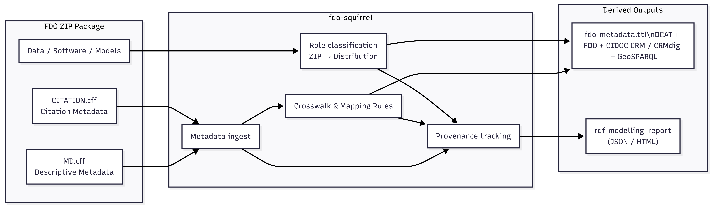

# FAIR Data Object, exchangeable — Squirrel Implementation (FDOx Squirrel)


**v0.1 – Reference implementation (ZIP-based FDOx → RDF)**

> *FDOx (FAIR Data Object, exchangeable) is a reference implementation of the FAIR Digital Object (FDO) framework, emphasising exchangeability through Linked Open Data and a Wikibase-compatible RDF vocabulary.*

`fdo-squirrel` is a **reference implementation for modelling FAIR Data Objects, exchangeable (FDOx)** from self-contained ZIP packages into **machine-readable RDF**.  
It demonstrates a **package-centric, reproducible crosswalk** from community-standard metadata files to interoperable knowledge graph representations.

---

## What it does

Given a **ZIP package as Source of Truth**, `fdo-squirrel`:

- reads **descriptive metadata** from `MD.cff`
- reads **citation metadata** from `CITATION.cff`
- inspects the **ZIP contents** (files, sizes, checksums)
- generates a **single RDF/Turtle representation** of the FDOx
- records **provenance** for every mapped field

The result is a **self-describing FDOx** that can be ingested into RDF-based infrastructures and knowledge graphs.

### Architecture overview



---

## Input requirements

The input **must be a ZIP file** containing at least:

### 1. `CITATION.cff`
- Valid according to the **Citation File Format (CFF)** specification  
  https://citation-file-format.github.io/
- Used for:
  - creators / authors
  - citation-related metadata

### 2. `MD.cff`
- Valid according to the **project-specific MD.cff schema**
- Used for:
  - FDOx type (`fdo:SoftwareFDO`, `fdo:AnalysisFDO`, `fdo:3DDataFDO`)
  - title, description, version
  - licence, publisher
  - spatial and temporal metadata

### 3. Arbitrary package content
- data, software, models, documentation, etc.
- each file becomes a `dcat:Distribution`
- roles are assigned via rule-based classification

---

## Output

Running the pipeline produces, in `output/`:

- **`fdo-metadata.ttl`**  
  RDF/Turtle representation of the FDOx, combining:
  - DCAT
  - FDOx vocabulary
  - CIDOC CRM / CRMdig
  - GeoSPARQL (if applicable)

- **`rdf_modelling_report.json`**  
  A machine-readable provenance report documenting:
  - which field came from which source
  - how many triples were generated per mapping step

- **`rdf_modelling_report.html`**  
  Human-readable HTML version of the modelling report

- **`fdo_overview.mermaid`**  
  A Mermaid flowchart summarising the FDO (core metadata, distributions by role)

- **`fdo_overview.jpg`** *(optional)*  
  A high-resolution render of the diagram above. Needs `mmdc`
  ([Mermaid CLI](https://github.com/mermaid-js/mermaid-cli)) on `PATH` and
  Pillow installed; if either is missing, this step is skipped with a
  one-line warning and everything else still runs.

- **`<package-name>-fdo-bundle.zip`**  
  The original source ZIP plus all of the files above, packaged into one
  self-contained, ready-to-(re)publish archive - replacing any stale copies
  of those same filenames the source ZIP already carried (from a previous
  manual round of this same workflow, for example).

All of the generated files - including the TTL and the bundle's own
contents - are themselves described as `dcat:Distribution` entries inside
`fdo-metadata.ttl`, using the same content-addressing and role
classification as the original ZIP's members: the finished bundle is fully
self-describing, not just a folder of loosely related files.

---

## How to run

### Option A – via local config (recommended for development)

Create a local file **`config.local.json`** (not committed):

```json
{
  "package_source": "C:/tmp/fdox/ogham-analysis.zip"
}
```

Then run:

```bash
python main.py
```

---

### Option B – via command line (one-off runs)

```bash
python main.py --package "C:/tmp/fdox/GEARS_1.zip"
```

`--package` (or its short form `-p`) accepts a local path or a direct ZIP
URL, and takes priority over `config.local.json` and the hardcoded
`PACKAGE_SOURCE` fallback in `main.py` for that one run - nothing else
needs to change to try a different package.

---

### Optional – high-resolution diagram render

`fdo_overview.jpg` needs Node.js plus the Mermaid CLI:

```bash
npm install -g @mermaid-js/mermaid-cli
pip install -r requirements.txt   # picks up Pillow, used for the PNG->JPG step
```

Without these, `python main.py` still produces everything else - the JPG
render is the only step that's skipped, not the whole run.

---

## Requirements

- Python ≥ 3.10
- Install dependencies:
  ```bash
  pip install -r requirements.txt
  ```

---

## Status

This is a **v0.1 reference implementation**.

- ✔ stable RDF output
- ✔ valid Turtle
- ✔ deterministic identifiers
- ✔ explicit provenance
- ✔ suitable for documentation and scientific publication

The focus is **correctness, transparency, and explainability**, not performance or completeness.

---

## Why this matters

`fdo-squirrel` shows how **FAIR Data Objects, exchangeable (FDOx) can be modelled as self-contained, package-based entities**, where:

- metadata and data stay together
- RDF is derived, not manually curated
- provenance is explicit and reproducible

This makes FDOx suitable for **long-term reuse, federation, and knowledge graph integration**.